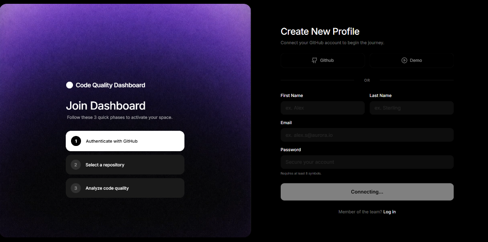

# 🚀 Code Quality Dashboard

A full-stack, AI-ready code analysis platform that integrates seamlessly with GitHub to provide actionable insights into your codebase's health, complexity, and maintainability.

### 🌐 **[Live Demo (Vercel)](https://code-quality-dashboard-topaz.vercel.app/)**

---

## ✨ Features

- **GitHub OAuth Integration:** Securely connect and pull repositories directly from your GitHub account.
- **Deep Code Analysis:** Calculates Cyclomatic Complexity, Maintainability Index, and Halstead Metrics.
- **Multi-Language Support:** Analyzes Python (via AST/Radon) and generates heuristic metrics for JavaScript, TypeScript, and other generic files.
- **Interactive Visualizations:** Beautiful, dark-mode charts built with Recharts to visualize tech debt and code distribution.
- **Premium UI/UX:** Features a state-of-the-art onboarding flow with mesh gradients and Framer Motion animations.

---

## 📸 Interface Preview

*The brand-new Aurora-inspired authentication interface.*

---

## 🛠️ Technology Stack

### **Frontend**
- **Framework:** React 18 (Vite)
- **Styling:** Tailwind CSS v3
- **Animations:** Framer Motion
- **Icons:** Lucide React
- **Charting:** Recharts
- **Hosting:** Vercel

### **Backend**
- **Framework:** FastAPI (Python 3.11)
- **Database:** SQLite (with SQLAlchemy & Alembic)
- **Code Analysis Engines:** Radon (Python AST) + Custom Heuristics
- **Hosting:** Render (Dockerized)

---

## 🚀 Local Setup

### 1. Clone the repository
\\ash
git clone https://github.com/hussnainahmedd/code-quality-dashboard.git
cd code-quality-dashboard
\
### 2. Start the Backend (FastAPI)
\\ash
cd backend
python -m venv venv
source venv/bin/activate  # On Windows use: venv\Scripts\activate
pip install -r requirements.txt
uvicorn app.main:app --reload
\
### 3. Start the Frontend (Vite)
\\ash
cd ../frontend
npm install
npm run dev
\
---

## 📝 License

This project is licensed under the MIT License - see the LICENSE file for details.

---
*Built with ❤️ for better code.*
